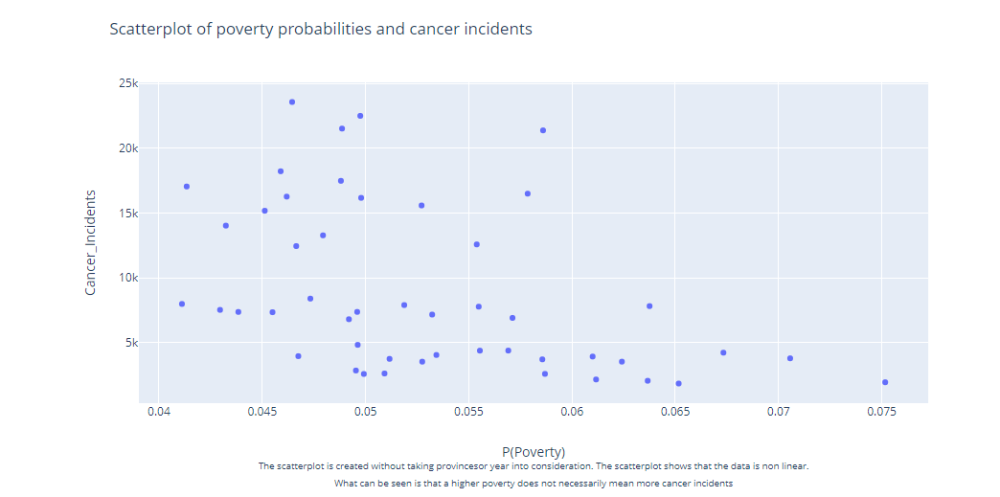
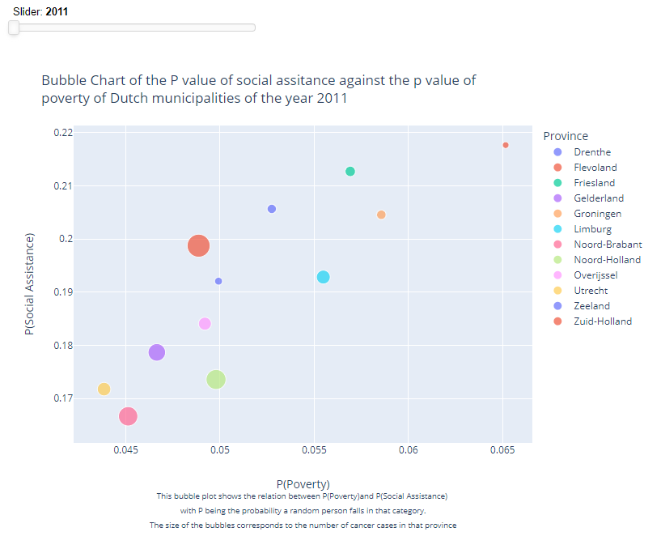
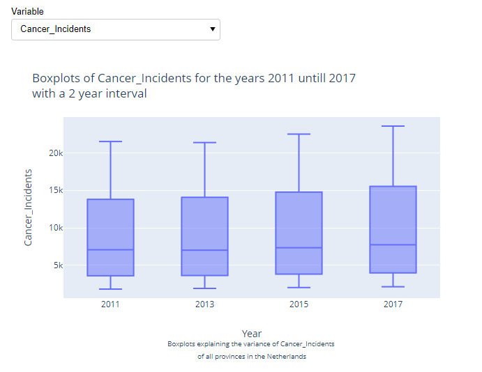
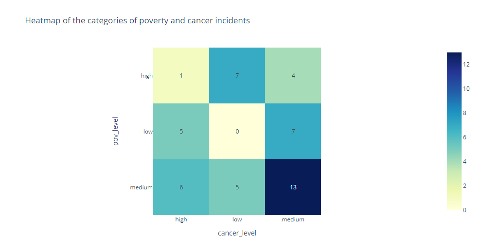

# Programming1FinalAssignment

People in poverty may be forced to buy lesser food, a lesser house and have less money to spend on hobbies. Due to these reasons cancer may occur more often among people living in poverty than among people living above the poverty line. In order to find an answer to this several datasets were used. Two datasets containing the municipalities in 2010 and 2018 were used. These were required because the data containing the information about cancer incidents only contained the information per province, rather than municipality. Therefore one final dataset was required as well. This datafile contained information about which municipality is located in which province. Combining all of these datasets made it possible to make a table containing the poverty and social assistance probabilities with the number of cancer incidents per province. Using this dataframe several visualisations were created to find an answer to the research question.

# Research Question
## Does cancer occur more often in provinces which have a high poverty probability?

# Hypothesis
## Cancer occurs more often in provinces with a high poverty probability.

# Required Files

1. [Municipalities 2010](https://www.cbs.nl/nl-nl/onze-diensten/methoden/classificaties/overig/gemeentelijke-indelingen-per-jaar/gemeentelijke-indelingen-alfabetisch-en-numeriek/gemeenten-alfabetisch-per-provincie-2015/gemeenten-alfabetisch-per-provincie-2010)
2. [Municipalities 2018](https://www.cbs.nl/nl-nl/cijfers/detail/83859NED)
3. [Cancer Incidents](https://iknl.nl/nkr-cijfers?fs%7Cepidemiologie_id=506&fs%7Ctumor_id=1&fs%7Cregio_id=525%2C527%2C529%2C521%2C528%2C526%2C520%2C522%2C518%2C519%2C523%2C524&fs%7Cperiode_id=568%2C570%2C572%2C545&fs%7Cgeslacht_id=623&fs%7Cleeftijdsgroep_id=656&fs%7Cjaren_na_diagnose_id=666&fs%7Ceenheid_id=683&cs%7Ctype=line&cs%7CxAxis=periode_id&cs%7Cseries=regio_id&ts%7CrowDimensions=periode_id&ts%7CcolumnDimensions=regio_id&lang%7Clanguage=nl)
4. [Municipalities per Province](https://digitaal.scp.nl/armoedeinkaart2019/waar-wonen-de-armen-in-nederland/)

The data of the cancer incidents(3) may be of a different selection, as using the URL with the correct selections does not seem to work 100% of the time.
Voor kankersoorten alle kankersoorten was selected. Geografie was set to provincies. Geslacht was set to man & vrouw and eenheid was set to aantal.
Finally, the years that were selected were 2011 until 2017.
# Software
The code is written in python 3.8.7, using jupyter notebook.
Several packages were used to enhance the visualisations and file processing.
These packages will be listed here, with a short explanation about what they are used for.

1. Logging 3.8.7
    - Logging is a package that makes it easy to log the code. Almost every code
      contains a try and except statement. This ensures that the code will never break.
      If the code is run successfully, a message describing the code that has ran will be printen
      to a log file. If it doesn't run successfully the error message will be written instead.
2. Pandas 1.2.1
    - Pandas is a package that is used to read and process the data.
3. Plotly 0.4.1
    - Plotly is used to create a single scatter plot.
4. yaml 5.4.1
    - Yaml is used in conjunction with the Path package. This makes it possible to
      use a config file, preventing hard coded paths.
5. pathlib 3.4
    - See package 4 yaml
6. Numpy 1.22.1
    - Numpy is a package that allows for array-processing. It is used for a 
      multitude processes.
7. Panel 0.12.6
    - Panel is a package that assists in creating interactive plots. It is used
      to create the bubble and boxplot.
8. statsmodels 0.13.1
    - statsmodels is a package that provided many statistical functions.
9. scipy 1.6.0
    - From scipy a specific subpackage and function is used, namely the chi2_contigency function
10. IPython 7.27.0
    - From IPython only a single function is used, namely md. This allows for python code
      to be printen as markdown in a cell in jupyter notebook.

# Visualisations
## Scatterplot
A scatterplot showing the relation of poverty probability and cancer incidents
probability has been created. It shows that there is no strong relationship between the two.

## Bubbleplot
Several visualisations are produced to try and find an answer to the research question and prove/disprove the hypothesis. 
One of them is a bubble plot. The x-axis of this plot contains the poverty probability, the y-axis contains the social assistance probability and the size of the bubbles describes the number of cancer incidents. Each bubble contains the information of a province for a selected year. The year can be changed via the slider located above the bubble plot. The information of specific provinces can be turned off by selecting that province from the legend.
Below an example of the bubble plot can be seen. Do note that this one is not interactive.

## Boxplot
In addition to the bubbleplot, a boxplot has been created as well. 
The boxplots show the spread of data of a specific type(either poverty probability, 
social assistance probability or number of cancer incidents) for the years 2011, 2013, 
2015 and 2017 in the provinces of the Netherlands. Note that the boxplots are created per year, not per province. 
The variable for which to see the spread of the data can be selected via the dropdown menu located above the plot.

## Heatmap
The final visualisation that created is a heatmap. Before constructing the heatmap the poverty probability and number of cancer 
incidents were changed to be categorial data. This was achieved by determining the 1st and 3rd quatiles 
of both data arrays. If a value was lower than the 1st quantile it would be considered low, if it was 
higher than the third quantile it would be considered high. If the value was in between the 3rd and 1st quantile it would 
be considered medium. From this a contingency table could be constructed. The contigency table is then used to draw the heatmap. 
The heatmap shows the number of combination of poverty and cancer levels.

In addition to the visualisation correlations tables were constructed as well. 
This was to research the relation between poverty and cancer incidents. The bubble plot provided this information as 
well, but it is worthwile to connect a number to this. Two kinds of correlation plots are created, one using the standard 
pearson method and one using the spearman method. spearman was used because the data is non-linear. 
Therefore, pearson may not provide any significant information.

After all the visualisations the chi2-test had been performed. This showed that
the number of cancer incidents and the poverty probability are dependent on one another
, but the exact relation still remains unclear.
